

الموارد البشرية والتنمية الاجتماعية
✦

           

<h1 style="color: white; font-size: 56px; font-weight: 800; margin: 0; line-height: 1.2;">دليل الاستخدام</h1>

نظام بصيرة — مركز التأهيل الشامل بمنطقة الباحة

الإصدار التعريفي والتشغيلي الكامل

مايو ٢٠٢٦

Classification: Strict مقيّد

---

# جدول المحتويات

| | |
|---|---|
| ✦ | عن نظام بصيرة — الرسالة وما يُميِّزه |
| ✦ | مميِّزات النظام التي تَنقلهُ نقلةً نوعيَّة |
| **٠١** | تَسجيل الدخول وتَهيئة الحساب |
| **٠٢** | الشاشة الرئيسية ولوحة القيادة التنفيذية |
| **٠٣** | المستفيدون — استعراض البيانات وملف الكرامة |
| **٠٤** | الخدمات الطبية والمتابعة اليومية |
| **٠٥** | الخدمات الاجتماعية ومحرك التمكين |
| **٠٦** | الحوكمة والجودة والتميز المؤسسي |
| **٠٧** | العمليات اليومية — الإعاشة، الأصول، السلامة |
| **٠٨** | الذكاء والتنبؤ — الإنذار المبكر ونبض المركز |
| **٠٩** | التقارير والمؤشرات الاستراتيجية |
| **١٠** | بوصلة القيادة الاستراتيجية |
| **١١** | الإدارة والصلاحيات وسجلات التدقيق |
| **١٢** | لوحة القيادة الإشرافية الإقليمية |

---

# عن نظام بصيرة

نظام **بصيرة (بصيرة)** منظومة عمليات رقمية متكاملة، صُمِّمَت لخدمة مراكز التأهيل الشامل التابعة لقطاع التنمية الاجتماعية، وتُطبَّق ابتداءً في **مركز التأهيل الشامل بمنطقة الباحة** كبيئة Sandbox، تَمهيداً للتعميم على ٣٨ مركزاً في عموم المملكة.

### رسالة النظام

أن يَنتقل العمل في مراكز التأهيل من نمط التَوثيق الورقي والإجراءات المتفرِّقة، إلى منظومة موحَّدة تَضع **المستفيد في المركز**، وتُمكِّن الكوادر من تَقديم خدمة كريمة قابلة للقياس، وتُتيح للقيادات رؤيةً شاملةً للأداء والأثر.

### ما يُميِّز بصيرة

- **النموذج الاجتماعي للإعاقة** أساس التصميم: المستفيد لا يُعَامَل كحالة، بل كإنسان تُزال عن طريقه الحواجز الاجتماعية.
- **ملف الكرامة** كركن مستقلّ يُوثِّق ما يُحبُّه المستفيد، تَفضيلاته الحسيَّة، أسلوب التواصل المفضَّل لديه، وسجلّ أعماله الكريمة.
- **محرِّكات ذكية** تَعمل على بيانات المركز محلياً (مروءة لتَوزيع الكوادر، حسّة زكية لتقييم المخاطر، بوصلة القيادة لقرارات الاستراتيجية).
- **حوكمة مُحكَمَة**: التزام كامل بالضوابط الأساسية للأمن السيبراني وسياسات الوزارة لحماية البيانات الشخصية وأخلاقيات الذكاء الاصطناعي من سدايا.
- **استئناس الخدمة** كقرار تَصميمي، لا كشعار: المستفيد مُستفيد لا "مريض"، التدخُّل تَمكين لا "علاج".

> **القيمة المضافة للمستفيد المباشر:** مَلَفّ شخصي لا يُنسى، خطّة تأهيل تتطوَّر معه، أسرة على تواصل مستمر، فريق رعاية مُتسق رغم تَغيُّر الكوادر، وأثر تأهيلي مَقيس ومَعروض.

---

# مميِّزات النظام

تَمتدّ مميِّزات بصيرة عبر ثلاثة محاور:

### المحور الأول — الإنسان أوَّلاً

- مَلَفّ الكرامة (Dignity Profile) كركن مستقلّ.
- بَوابة الأسرة لتَواصل مستمرّ بين المركز وذوي المستفيد.
- محرِّك التَمكين (Empowerment Engine) لتَتبُّع أهداف التأهيل الفردية.
- لغة موحَّدة "مستفيد" / "حاجز" / "تَدخُّل".

### المحور الثاني — الكوادر بكفاءة وعدالة

- محرِّك مروءة للوقاية من الاحتراق المهني وتَوزيع الكوادر بعدالة.
- بَوابة موحَّدة لكل التَخصُّصات (طبية، اجتماعية، تَأهيلية، إدارية).
- نَموذج تَسليم المناوبات الذكي (Handover) لمنع فقدان المعلومة بين الورديات.

### المحور الثالث — قيادة بِبيانات لا بانطباعات

- لوحة قيادة تَنفيذية فورية بمؤشِّرات حقيقية.
- محرِّك حسّة زكية لتَقييم المخاطر السريرية والسلوكية.
- نظام الإنذار المبكر للحالات والعنابر.
- بُوصلة القيادة لحفظ القرارات الاستراتيجية ومسارها.
- تَقارير العائد الاجتماعي للاستثمار (SROI) للقيادات والإدارات العامة.

> **للقارئ من القيادات:** المؤشِّرات لم تَعُد تُجمَع يدوياً من تقارير شهرية متأخِّرة. هي مَوصولة بالبيانات الفعلية وتُحدَّث لحظياً.

> **للقارئ من رؤساء الأقسام:** ما كان يُنجز سابقاً في خمسة نماذج ورقية متفرِّقة، يُنجز الآن في إجراء واحد، ويصل تلقائياً إلى لوحة القيادة دون تَكرار للإدخال.

> **للقارئ من مدير المركز:** القرار الذي يُتَّخذ يَوم الأحد يَبقى موثَّقاً بسياقه، يَستطيع المدير اللاحق بعد سنوات أن يَقرأ لماذا اتُّخِذَ، ولماذا اختير ما اختير من البدائل.

---

      

<h1 style="color: #F7941D; font-size: 88px; font-weight: 800; margin: 0; text-align: right;">٠١</h1>
<h2 style="color: #0F3144; font-size: 36px; font-weight: 700; margin-top: 8px; text-align: right;">تَسجيل الدخول وتَهيئة الحساب</h2>

<svg width="150" height="80"><path d="M 0 80 Q 50 60 100 50 Q 130 40 150 0" stroke="#F7941D" stroke-width="2" fill="none"/></svg>

---

## ٠١ — تَسجيل الدخول وتَهيئة الحساب

تَتَوفَّر في بصيرة قَنَوات دخول مُتعدِّدة، وَفقَ نوع المستخدم وموقعه:

### ١-١ صفحة الدخول الأساسية

عند الانتقال إلى الرابط الرسمي للنظام، تظهر شاشة الدخول بهويَّة الوزارة المعتمَدَة.

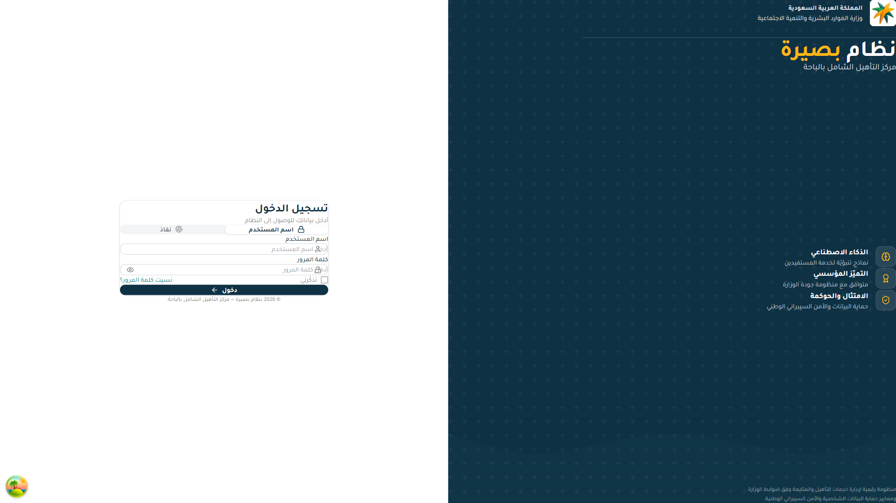

#### آلية الدخول

١. يَدخل المستخدم بَيانات هويَّته الوظيفية (البريد المؤسَّسي أو الهوية الوطنية) عبر **النَفاذ الوطني الموحَّد** (Single Sign-On).  
٢. يَستلم رمز التحقُّق على جواله الرسمي المُسَجَّل لدى إدارة الموارد البشرية.  
٣. يَدخل الرمز ويَنتقل تلقائياً إلى الشاشة المناسبة لدوره الوظيفي.

#### نَطاق الصلاحيات

تَخضع كل عمليَّة دخول لـ:

- **التَوثُّق المتعدِّد العوامل** (MFA) للأدوار العالية.
- **تَقييد الوصول حسب الدور**: مدير، إداري، طبيب، اختصاصي اجتماعي، مُشرف، ممرض، موظف عام.
- **أمن مستوى الصف** (Row-Level Security): الموظف لا يَرى من بيانات المستفيدين إلا ما يَخصّ نطاق عمله.
- **تَدقيق آلي**: كل دخول وكل تَفاعُل يُسَجَّل في سجلّ تَدقيق غير قابل للتعديل، تَطبيقاً لسياسة `DT-IS-POL-1300 V7` لإدارة سجلات الأحداث والمراقبة.

> **للقارئ من إدارة الإشراف الاجتماعي بفرع الوزارة:** يَمنحك النظام رؤيةً عابرةً لكل مستفيدٍ ضمن نطاق إشرافك، مع تتبُّع كامل لِما تَمَّ من خَدَمات في كل مركز خاضع لإشرافك.

> **للقارئ من المدير العام بفرع الوزارة:** الدخول يُتيح لك رؤية مُجَمَّعَة لكل المراكز والوحدات في منطقتك، مع إمكانية الاستفسار العميق عند الحاجة.

---

      

<h1 style="color: #F7941D; font-size: 88px; font-weight: 800; margin: 0; text-align: right;">٠٢</h1>
<h2 style="color: #0F3144; font-size: 36px; font-weight: 700; margin-top: 8px; text-align: right;">الشاشة الرئيسية ولوحة القيادة التنفيذية</h2>

---

## ٠٢ — الشاشة الرئيسية ولوحة القيادة التنفيذية

بعد تَسجيل الدخول، تَنفتح الشاشة الرئيسية. تَتألَّف من ثلاثة أقسام:

١. **الترويسة** (أعلى الشاشة): اسم المركز، شعار الوزارة، اسم المستخدم ودوره، إشعارات اللحظة، وصلاحية تَسجيل الخروج.  
٢. **الشريط الجانبي** (يَمين الشاشة، لاتجاه RTL): تسعة أقسام رئيسية تَفتح وحدات النظام.  
٣. **منطقة المحتوى** (مركز الشاشة): تَعرض لوحة القيادة التنفيذية افتراضياً.

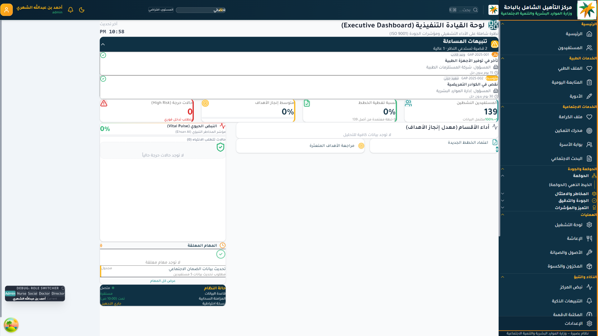

### ٢-١ الأقسام التسعة في الشريط الجانبي

| رقم | القسم | الوحدات الفرعية | الجمهور المُستفيد |
|---|---|---|---|
| ١ | الرئيسية | الصفحة الرئيسية، المستفيدون | كل المستخدمين. |
| ٢ | الخدمات الطبية | الملف الطبي، المتابعة اليومية، الأدوية | الكوادر السريرية. |
| ٣ | الخدمات الاجتماعية | ملف الكرامة، محرك التمكين، بوابة الأسرة، البحث الاجتماعي | الاختصاصيون الاجتماعيون. |
| ٤ | الحوكمة والجودة | الخيط الذهبي، المخاطر، الجودة، التميز، الدرع القانوني | قسم الجودة والإدارة العامة. |
| ٥ | العمليات | لوحة التشغيل، الإعاشة، الأصول، المخزون | المالية والتشغيل. |
| ٦ | الذكاء والتنبؤ | نبض المركز، التنبيهات الذكية، المكتبة الرقمية | المدير وقيادات الإدارة. |
| ٧ | التقارير | لوحة التقارير، تَقرير العائد الاجتماعي | الإدارة العامة والوزارة. |
| ٨ | القيادة الاستراتيجيّة | بُوصلة القيادة | المدراء والوكلاء. |
| ٩ | الإدارة | الهيكل التنظيمي، الموظفون، الصلاحيات | المدير وإدارة الموارد البشرية. |

### ٢-٢ مَا تَعرضه لوحة القيادة فوراً

- **بطاقات التنبيهات والمساءلة**: عَدد القضايا المستحقة النَظَر، مع مستويات أهميَّة (عالية / متوسطة / منخفضة).
- **مؤشِّرات الإنجاز**: نسبة تَغطية الخطط، نسبة قَفز الأهداف، نسبة الأنشطة، نسبة المتابعات اليومية الكاملة.
- **عدد المستفيدين النشطين** الإجمالي وفي كل عَنبَر.
- **نَبض المركز (Vital Pulse)**: مؤشِّر لحظي على حالة المخاطر العامة في المركز (مَستمَدّ من محرك حسّة زكية).
- **مؤشِّر إحسان**: مؤشِّر تَقدُّم نَوعي على جودة الخدمة الإنسانية.
- **أداء الأقسام**: لوحة بمعدَّل إنجاز الأهداف لكل قسم بصرياً.
- **المهام المعلَّقَة** القريبة من المستخدم.
- **سجل الأنشطة الأخيرة**.

> **للقارئ من القيادات:** اللوحة تُغني عن الطلب الدوري لتقارير "كم مستفيداً نَخدم" أو "ما مستوى الأداء" — الأرقام أمامك، مُحَدَّثَة لحظياً، قابلة للاستفسار العميق بنقرة.

> **للقارئ من مدير المركز:** الصورة العامة لمركزك في شاشة واحدة. كل بطاقة قابلة للنقر لمعرفة التَفاصيل ومَن يَتولى المعالجة.

> **للقارئ من رؤساء الأقسام والوحدات:** بطاقات قسمك ضمن اللوحة تُمَيَّزُ لك تلقائياً، فتراها قبل غيرها.

---

      

<h1 style="color: #F7941D; font-size: 88px; font-weight: 800; margin: 0; text-align: right;">٠٣</h1>
<h2 style="color: #0F3144; font-size: 36px; font-weight: 700; margin-top: 8px; text-align: right;">المستفيدون — استعراض البيانات وملف الكرامة</h2>

---

## ٠٣ — المستفيدون — استعراض البيانات وملف الكرامة

ركن النظام كلُّه. كل المُحَركات والوحدات تَعود في النهاية إلى ملف المستفيد.

### ٣-١ شاشة قائمة المستفيدين

عند النقر على "المستفيدون" في الشريط الجانبي، تَنفتح قائمة المستفيدين النشطين في المركز.

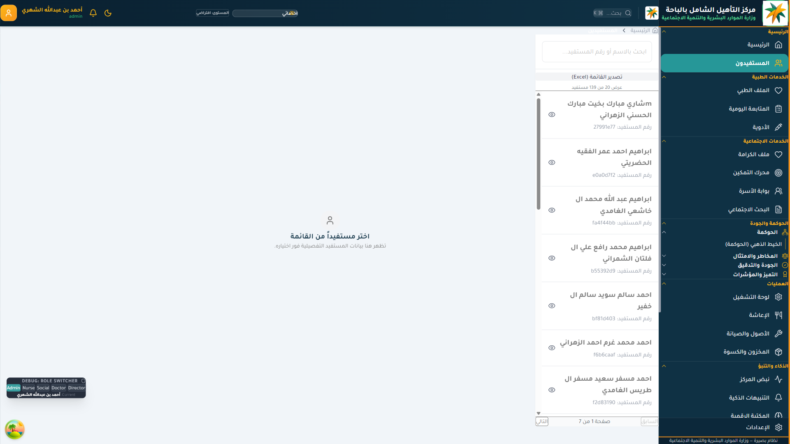

#### الميزات

- **البحث المتقدِّم**: بالاسم، الرقم، نوع الإعاقة، العنبر، الحالة.
- **الفلترة الذكية**: حالات الخطر العالي، حالات تَحتاج متابعة، قَوائم انتظار، أسماء قَيد التَخطيط.
- **العرض المتعدِّد**: قائمة، بطاقات، حسب العنبر.
- **الإجراءات السريعة**: فتح الملف، إضافة ملاحظة، تَسجيل حدث، تَكليف موظف.
- **حالة الملف**: مكتمل / مَنقوص / يَستلزم تَحديثاً.

### ٣-٢ ملف المستفيد المتكامل

النَقر على اسم المستفيد يَفتح ملفه الكامل، ويَتألَّف من خمسة أقسام رئيسية:

١. **البَطاقة التَعريفية** (الاسم، الرقم، تاريخ الالتحاق، العنبر، الفريق المُعالِج).  
٢. **الملف الطبي** (التشخيصات الموثَّقَة، الأدوية، الحساسيات، تاريخ الحوادث).  
٣. **ملف الكرامة** (مفصَّل أدناه).  
٤. **خطّة التأهيل والتمكين** (الأهداف التأهيلية، نسب الإنجاز، التَدخُّلات).  
٥. **المتابعة اليومية** (سجل الأنشطة، الاستهلاك الغذائي، النوم، الحالة المزاجية).

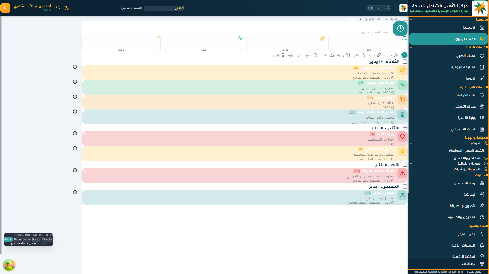

### ٣-٣ ملف الكرامة — الميزة الجوهرية

ملف الكرامة هو ما يُمَيِّز بصيرة عن أيِّ نظام إدارة مَراكز سابق. يَحتوي:

#### نوع الشخصية وأسلوب التواصل
- نوع الشخصية: اجتماعي / حيوي / هادئ / مُلاحظ.
- وَصف نَصيّ حُرّ: ما يَخبر به الموظف الذي عَرَفَه.
- أسلوب التواصل المفضَّل: لفظي / بلغة الإشارة / بالإشارات / بالصور / مَختلَط.
- "أفضل أسلوب لإشراكه" (`bestWayToEngage`) — حقل نَصّي مفتوح، يَكتب فيه الموظف العارف به ما لا تَلتقطه الخانات: مثلاً "يَبتسم إذا حُيِّيَ بـ'أبا فلان'، يَصمت إذا قيل اسمه المجرَّد".

#### التَفضيلات الحسيَّة
- الإضاءة المفضَّلة (مُعتمَة / ساطعة / طبيعية / لا فرق).
- الضَجيج المُسْتساغ (هادئ / متوسط / حيوي).
- الحرارة (مُعتدل / دافئ / بارد).
- الروائح المُستحَبَّة أو المُنفِّرة.

#### المحبوبات والمنفِّرات
- الطعام المفضَّل / المنفِّر.
- الأنشطة المحبَّبَة.
- الأماكن، الأشخاص، الألوان.
- المحفِّزات السلبية والمَخاوف.

#### سجل الأعمال الكريمة (`deeds`)
ركنٌ مستقلّ يُوَثِّق:
- الأعمال الروحية (صلاة، ذكر، صيام، صدقة).
- الأعمال الاجتماعية (مساعدة، مشاركة، اعتذار، مصالحة).
- الأعمال الشخصية (إنجاز شخصي، تَجاوُز خوف).
- الأعمال الإبداعية (رَسم، صوت، حَرَكة، حِرَفَة).
- نَصرة الآخرين.

كل عمل يُوَثَّق مع: التاريخ، الفئة، مستوى الأثر، من شَهد عليه.

> **القيمة التشغيلية لملف الكرامة:**  
> هذا الملف هو **أوَّل** ما يَفتحه أي موظف يَلتقي بالمستفيد. ليس آخر ما يَفتح. الملف الطبي يَأتي بعد الكرامة — لا قبلها — لأن الكرامة هي سياق الحالة، لا تَفصيل لاحق منها.

> **للقارئ من رؤساء الأقسام:** ملف الكرامة مَطلوب من كل قسم تَحديثه ربع سنوياً، ضمن مؤشِّرات الأداء التي يَحسبها النظام تلقائياً.

> **للقارئ من إدارة الإشراف الاجتماعي:** جودة ملف الكرامة في كل مركز هي مؤشِّر مباشر على جودة معرفة المركز بمستفيديه. مَركز فيه ٧٠٪ من الملفَّات بحقول فارغة، يَستحقّ نَظرة إشرافية.

---

      

<h1 style="color: #F7941D; font-size: 88px; font-weight: 800; margin: 0; text-align: right;">٠٤</h1>
<h2 style="color: #0F3144; font-size: 36px; font-weight: 700; margin-top: 8px; text-align: right;">الخدمات الطبية والمتابعة اليومية</h2>

---

## ٠٤ — الخدمات الطبية والمتابعة اليومية

تُقدِّم وحدة الخدمات الطبية إطاراً متكامِلاً للجوانب الصحية ضمن خدمة التأهيل، دون أن تَحوِّل المركز إلى مستشفى. الخدمة الطبية في بصيرة **مساعِدة** للتأهيل الاجتماعي، لا أصلية.

### ٤-١ تَقييم مَخاطر السقوط

شاشة تَخصصُّيَّة لرصد وتَقييم مخاطر السقوط، بناءً على معايير دولية مكيَّفَة لبيئة المركز.

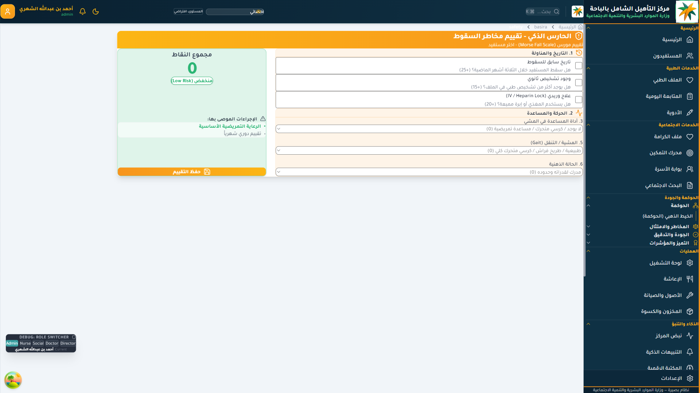

#### آلية العمل

١. الفريق يُجري تَقييماً لكل مستفيد عند الالتحاق، ثم دورياً (شهرياً / بعد كل حادث).  
٢. النَّظام يُولِّد تَلقائياً درجة خطورة وتَوصيات وقائية.  
٣. التوصيات تَنفذ كمهام موَزَّعة على الكوادر.  
٤. أي حادث يُسَجَّل ويَدخل في حساب الدرجة لاحقاً.

### ٤-٢ المتابعة اليومية

سجل يومي لكل مستفيد، يَضمّ:

- **العلامات الحيوية** (في حالات الإقامة الإيوائية): ضغط، نبض، حرارة، تَشبُّع الأكسجين، السكَّر للحالات المعنيَّة.
- **استهلاك الوجبات والسوائل**.
- **حالة النوم والمزاج**.
- **الأنشطة المُنجَزَة في اليوم**.
- **ملاحظات الفريق** (طبية، تَأهيلية، اجتماعية).

#### الميِّزات الذكية

- **التَنبيه التلقائي**: عند تَجاوز قراءة العلامات الحيوية للنطاق الطبيعي.
- **التَتبُّع التَدريجي**: رسم بياني لتَطوُّر العلامات على مدى أسابيع.
- **ربط بالحوادث**: تَغيُّر مفاجئ في مزاج المستفيد قد يَنعكس في تَنبيه إنذار مبكِّر.

### ٤-٣ إدارة الأدوية

- جدول الأدوية الفعَّال لكل مستفيد.
- تَنبيه آلي بمواعيد الإعطاء.
- تَوثيق الإعطاء بِبصمَة الكادر المُسَجِّل.
- متابعة المخزون مع تَنبيه عند نَفاد الكميات.
- رَصد التَفاعُلات الدوائية المُحتمَلة.

> **للقارئ من القيادات السريرية:** المتابعة اليومية ليست فقط للتسجيل — هي مَصدر بيانات لمحرك حسّة زكية الذي يَسبق الأزمات. إذا كانت العلامات الحيوية لمستفيد تَتدهور تَدريجياً، يَكون التنبيه قَبل الأزمة بأيام، لا أثناءها.

> **للقارئ من رؤساء وحدات التَمريض:** كل مَناوبة تَستلم سجلاً واضحاً عن المستفيد، يَشمل ما حَدَث في النَوبة السابقة، بدون فقدان معلومة بسبب التَسليم.

---

      

<h1 style="color: #F7941D; font-size: 88px; font-weight: 800; margin: 0; text-align: right;">٠٥</h1>
<h2 style="color: #0F3144; font-size: 36px; font-weight: 700; margin-top: 8px; text-align: right;">الخدمات الاجتماعية ومحرك التمكين</h2>

---

## ٠٥ — الخدمات الاجتماعية ومحرك التمكين

هنا تَكمن رسالة بصيرة الجَوهرية. إذا كان الملف الطبي ضرورياً، فالخَدَمات الاجتماعية ومحرك التَمكين هما **سَبب وجود** المركز.

### ٥-١ محرك التمكين

شاشة موحَّدة لكل خطط التأهيل والتَمكين الفردية.

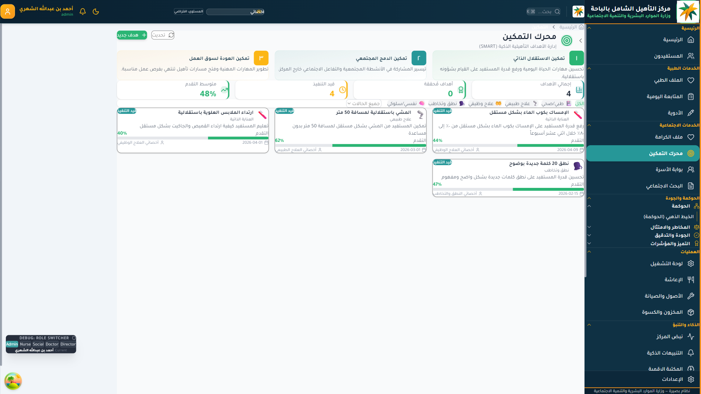

#### مكوِّنات الخطّة

١. **الأهداف التأهيلية الفردية**: مَصاغَة بِمَنطق SMART (محدَّدة، قابلة للقياس، قابلة للتحقيق، مرتبطة بالواقع، مؤطَّرة زمنياً).  
٢. **التَدخُّلات المخطَّطَة**: من قِبَل أي تَخصُّص (طبي، نَفسي، اجتماعي، تَأهيل مهني، تَأهيل حركي).  
٣. **مؤشِّرات النَجاح**: ما هي العلامات التي تَدلّ على التَقدُّم؟  
٤. **الجدول الزمني**: مراجعات شهرية، فصلية، سنوية.  
٥. **شَهادات التَقدُّم**: تَوثيق إنجازات يَستلمها المستفيد وأسرته.

#### التَوصيف الفلسفي للأهداف

كل هدف يجب أن يَكون **مَوجَّهاً للمستفيد، لا للموظف**:

- ❌ "تَطبيق برنامج العلاج الطبيعي ٣ مرات أسبوعياً" (هذا للموظف).  
- ✅ "تَمكين المستفيد من النُهوض من السرير دون مساعدة، خلال ٣ أشهر" (هذا للمستفيد).

### ٥-٢ بَوابة الأسرة

نَافذة الأسرة على المركز. تَفتح للأسرة (أو ولي الأمر) إمكانية:

- **مُتابَعة الخطّة التَأهيلية** للمستفيد بشكل دوري.
- **رؤية الأنشطة اليومية** والصور (بإذن الإدارة).
- **التواصل مع الفريق المعالِج** عبر قنوات مَحكَّمة.
- **المُشاركة في تَخطيط الزيارات** وإجازات نهاية الأسبوع.
- **تَقديم الشكاوى والاقتراحات** بسرّية.
- **تَقييم رضاهم** عبر استبيان شهري.

#### الالتزامات الإطارية

- **سرّية مَحكَمَة**: لا يَستطيع أحد من الأسر رؤية بيانات أسرة أخرى.
- **استجابة مَوقَّتة**: ٢٤ ساعة للرسائل العامة، ٤ ساعات للأسئلة العاجلة، فوري للحالات الحرجة.
- **حقوق المستفيد البالغ**: المستفيد البالغ القادر على التعبير له القَول الفصل في ما يُكشف لأسرته من بياناته الحساسة.

### ٥-٣ البحث الاجتماعي

الوحدة المختصَّة بالاختصاصيِّين الاجتماعيِّين:

- **التَقييم الاجتماعي الأوَّلي** عند الالتحاق.
- **البحث الاجتماعي الدَوري** (سنوياً أو عند الحاجة).
- **خطط الإرشاد الأسري**.
- **مُتابَعَة الزِّيارات والإجازات**.
- **التَقييمات النَفسية الاجتماعية**.

> **للقارئ من رؤساء الأقسام الاجتماعية:** كل تَقييم اجتماعي مُسَجَّل في النظام يُغذِّي ملف المستفيد ولا يَنسى. لا تَكرارَ في الأسئلة، لا فقدان لمعلومة بين سَنة وأخرى.

> **للقارئ من القيادات:** السطر الأخلاقي للنظام يَنعكس مباشرةً في هذه الوحدة. كل تَدَخُّل يُجيب عن سؤال "أيّ حاجز اجتماعي نُفكِّكه؟". إن غاب الجواب، التَدَخُّل يَستحقّ المراجعة.

---

      

<h1 style="color: #F7941D; font-size: 88px; font-weight: 800; margin: 0; text-align: right;">٠٦</h1>
<h2 style="color: #0F3144; font-size: 36px; font-weight: 700; margin-top: 8px; text-align: right;">الحوكمة والجودة والتميز المؤسسي</h2>

---

## ٠٦ — الحوكمة والجودة والتميز المؤسسي

الجودة في بصيرة ليست مَلَفَّاً منفصلاً. هي طبقة عابرة تُوازِنُ كل وحدة. لكن لها مَركز: قسم الحوكمة والجودة في الشريط الجانبي.

### ٦-١ مَركز التميز المؤسسي

شاشة موحَّدة تَجمع كل أدوات الجودة والتميز.

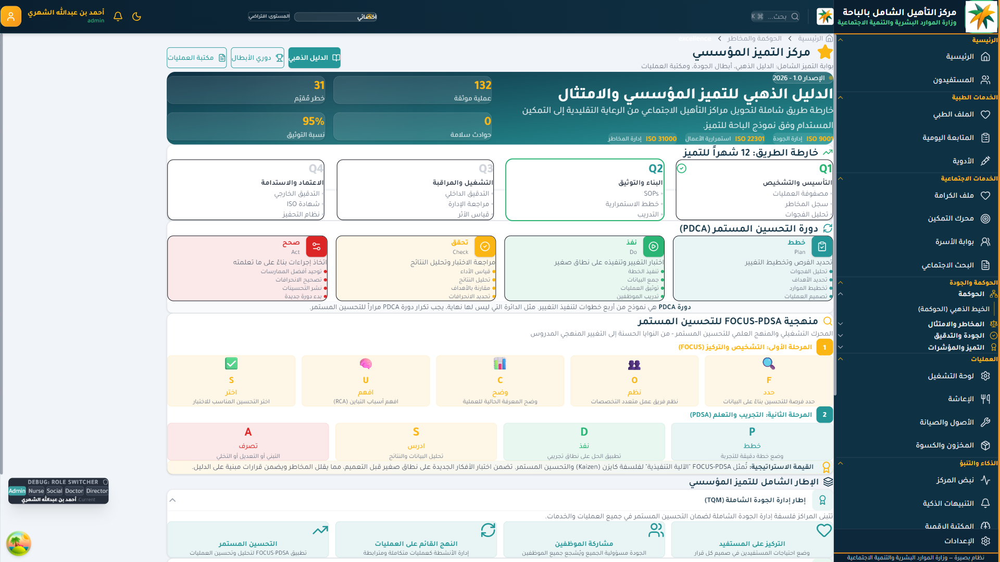

#### الوحدات الفرعية

- **الخيط الذهبي للحَوكَمَة**: إطار مَوحَّد لتَتبُّع كل سياسة من اعتمادها إلى تَطبيقها إلى مراجعتها.
- **سجل المخاطر**: مَنهجية مَوثَّقَة (ISO 31000) للتعامل مع المَخاطر التشغيلية والاستراتيجية.
- **درع السلامة (مكافحة العدوى)**: ضَمان بيئة آمنة من الناحية الميكروبية.
- **الامتثال ISO**: تَوثيق وتَتبُّع للالتزام بـ ISO 9001:2015 (نظام إدارة الجودة).
- **دليل الجودة**: المستندات الرسمية والإجراءات.
- **سجل عدم المطابقة (NCR) والإجراءات التصحيحية والوقائية (CAPA)**: تَوثيق مَنهَجي للأخطاء وتَصحيحها.
- **التدقيق الداخلي**: دورات تَدقيق منتظمة بسجلات قابلة للمراجعة.
- **لوحة الجودة**: مؤشرات أداء الجودة في لوحة قيادة منفصلة.
- **الدَرع القانوني**: تَتبُّع الالتزام التَشريعي والقانوني (مثل PDPL، نظام حقوق ذوي الإعاقة).

### ٦-٢ السلامة وَمكافَحَة العدوى (IPC)

شاشة تَخصُّصية لإدارة بيئة آمنة من الناحية الميكروبية.

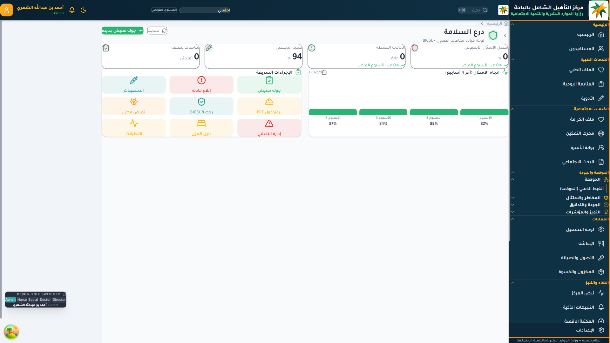

#### الميزات

- **التَفتيش اليومي**: نَموذج تَفتيش مَنتظم لكل العنابر والمَرافق.
- **بَلاغ الحوادث الميكروبية**: نَموذج إبلاغ سريع.
- **التَوعية والتَطعيمات**: تَتبُّع تَطعيمات الكوادر والمستفيدين.
- **مُعَدَّات الوقاية الشخصية (PPE)**: تَتبُّع المخزون والاستهلاك.
- **إدارة تَفشِّي الحالات**: سيناريوهات استجابة لأي تَفَشٍّ مُحتمَل.

> **مهم:** بصيرة لا يَعتمد على معايير CBAHI. مَراكز التَأهيل ليست مستشفيات. الإطار المَتَّبَع هو ISO 9001 (إدارة جودة عامة) وISO 45001 (سَلامة وصحة مهنية)، مع EQUASS (إطار جودة الخدمات الاجتماعية الأوروبي) كمَرجعية تَخصُّصية حيث تَنطبق.

### ٦-٣ التَدقيق الداخلي

دورات تَدقيق منتَظَمَة مع:

- خُطَّة التَدقيق السَنَوية.
- نَماذج التَدقيق الموحَّدة.
- سجلَّات النَتائج.
- مُتابَعَة الإجراءات التَصحيحية.
- تَقارير دَورية للقيادة.

> **للقارئ من قسم الجودة في كل مركز:** هذه الوحدة تَستبدل كل المَلَفَّات الورقية المتفرِّقة بنظام موحَّد لا يَفقد ذاكرة مؤسسية بِخُروج موظف.

> **للقارئ من إدارة الإشراف الاجتماعي:** جودة ما يُنفِّذه كل مركز مَكشوفة لك في لوحة موحَّدة. لا تَنتظر تَقريراً سنوياً متأخِّراً.

> **للقارئ من القيادات:** تَقارير الالتزام الجاهزة في النظام تُقدَّم مباشرة في تَقرير الوزارة السَنَوي عن أداء قطاع التنمية الاجتماعية، دون جَهد إضافي.

---

      

<h1 style="color: #F7941D; font-size: 88px; font-weight: 800; margin: 0; text-align: right;">٠٧</h1>
<h2 style="color: #0F3144; font-size: 36px; font-weight: 700; margin-top: 8px; text-align: right;">العمليات اليومية</h2>

---

## ٠٧ — العمليات اليومية

مَركز التأهيل الإيوائي مؤسسة تشغيلية كاملة: غذاء، صيانة، أصول، مَخزون، أمن. كل ذلك مُنَظَّم في وحدة العمليات.

### ٧-١ الإعاشة (وحدة التغذية)

شاشة متكامِلَة لإدارة وَجبات المركز اليومية.

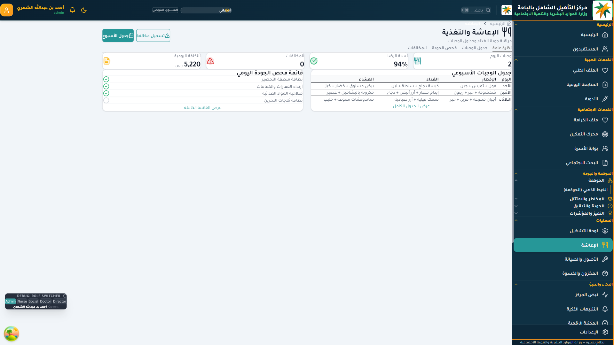

#### الوحدات الفرعية

- **اللوحة العامة للإعاشة**: نَظَرة على وَجبات اليوم، الكميات، المتلقِّين.
- **السجل اليومي للإعاشة**: تَوثيق ما قُدِّم فعلاً، ومَن استَهلك ومَن لا.
- **الفاتورة الشهرية**: حساب آلي لكلفة الإعاشة الشهرية.
- **مُراقبة الجودة**: نَماذج فَحص جودة الوجبات الواردة.
- **لوحة جودة الإعاشة**: مؤشِّرات صحَّيَّة وغذائية.
- **تَقارير الإعاشة**: تَقارير دَوريَّة (يومية، أسبوعية، شهرية).

#### الميزات الذكية

- **التَكامل مع الأنظمة الغذائية الفردية**: مستفيد لديه حساسية أو نظام غذائي خاص يَتبَع تَوصياته في كل وجبة.
- **حساب القيمة الغذائية**: تَوازن العناصر الغذائية في كل وجبة.
- **إدارة المُورِّدين**: تَقييم جَودة المُورِّد، تَوثيق الفواتير، إدارة العقود.

### ٧-٢ الأصول والصيانة

- **سجل الأصول**: كل أصل في المركز مُسَجَّل (أثاث، مُعَدَّات طبية، أَجهزة، وَسائل نَقل).
- **جَدول الصيانة الوقائية**: مواعيد دَورية لصيانة كل أصل.
- **بَلاغ الأعطال**: نَموذج إبلاغ سريع.
- **تاريخ الصيانة**: لكل أصل تاريخ كامل من إصلاحات وتَكاليف.

### ٧-٣ المخزون والكسوة

- **إدارة مخزون الكسوة**: لكل مستفيد قائمة احتياجات وَتَوزيع.
- **إدارة المخزون العام**: مَواد التشغيل، المعدات الاستهلاكية.
- **تَنبيه عند نَفاد المخزون**: لا تُستنزَف مادة فجأة.

> **للقارئ من المدير الإداري:** هذه الوحدة تُغني عن خمسة دفاتر وَرَقية على الأقلّ. كل العمليَّات الإدارية مَوثَّقَة وقابلة للتَدقيق.

> **للقارئ من القيادات:** التَكاليف التَشغيلية الفعلية مَحسوبة آلياً، ومَتاحة لتقارير الكفاءة الإنفاقية.

---

      

<h1 style="color: #F7941D; font-size: 88px; font-weight: 800; margin: 0; text-align: right;">٠٨</h1>
<h2 style="color: #0F3144; font-size: 36px; font-weight: 700; margin-top: 8px; text-align: right;">الذكاء والتنبؤ — الإنذار المبكِّر ونبض المركز</h2>

---

## ٠٨ — الذكاء والتنبؤ

ركن الفَرق النَوعي في بصيرة. هنا تَتلاقى البيانات والذكاء المؤسَّسي ليُنبِّها قبل الأزمة، لا أثناءها.

### ٨-١ مَركز المؤشِّرات الذكية

شاشة موحَّدة لكل مؤشِّرات الأداء.

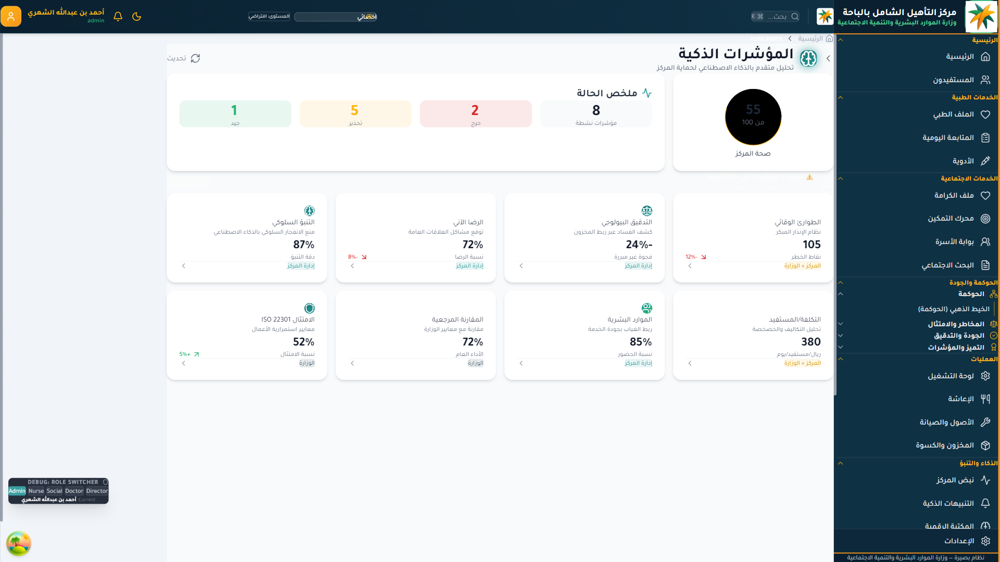

#### المؤشِّرات الموجودة

- **مؤشِّرات الإنذار المبكِّر**: حالات تَستحقّ الانتباه قبل أن تَتدهور.
- **التنبُّؤ السلوكي**: تَوقُّعات على سلوك المستفيد بناءً على تَاريخه.
- **التَدقيق البيولوجي**: تَتبُّع العلامات الحيوية اللازمة.
- **مؤشرات الرضا (نَبض الرضا)**: رضا المستفيد، رضا الأسرة، رضا الكوادر.
- **مؤشرات الكلفة لكل مستفيد**.
- **مؤشِّرات الأثر على الموارد البشرية (HR Impact)**.
- **الالتزام بـ ISO**.
- **المعدَّلات المعيارية (Benchmarks)**.
- **مؤشرات الأهداف الاستراتيجية**.

### ٨-٢ نظام الإنذار المبكِّر

شاشة تَخصُّصية للحالات التي تَستحقّ التَدخُّل قبل تَفاقُمها.

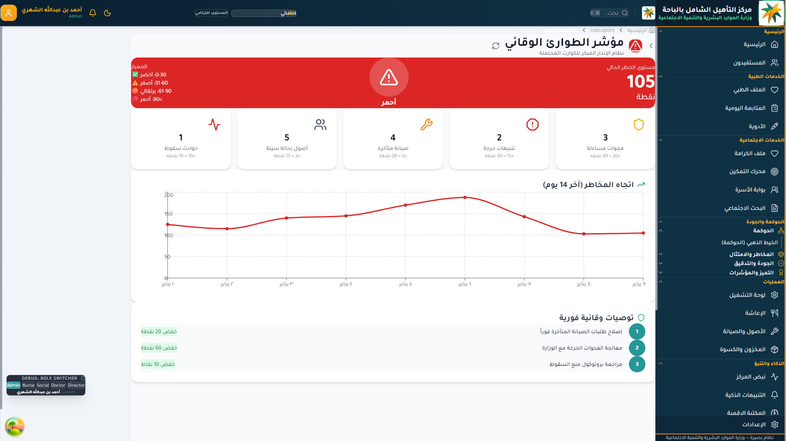

#### آلية العمل

١. النَّظام يَجمع بيانات يومية من كل المصادر (الملف الطبي، السلوك، النَوم، التَغذية، التَفاعُل الاجتماعي).  
٢. محرك حسّة زكية يُحلِّل التراكُمات.  
٣. عند تَجاوُز عَتَبَة معيَّنة، يَصدر تَنبيه ينتقل إلى المسؤول المعنيّ.  
٤. التَنبيه يَكون **شفّافاً قابلاً للتفسير**: لماذا صَدَر، ما العوامل، ما المُقتَرَح.  
٥. القرار يَبقى للإنسان دائماً. النَّظام يُنبِّه، ولا يُقَرِّر.

#### أنواع الإنذارات

- **إنذار سريري**: تَدهور مَلحوظ في علامة حيوية.
- **إنذار سلوكي**: تَغيُّر مفاجئ في نمط النَوم أو المزاج أو التَفاعُل.
- **إنذار اجتماعي**: عُزلَة متزايدة، انقطاع تَواصُل أُسري.
- **إنذار تَأهيلي**: تَوقُّف التَقدُّم في خطّة مستفيد.
- **إنذار جماعي (على مستوى العنبر)**: عَنبَر يَزداد فيه ضغط حالات الخطر العالي.

### ٨-٣ نَبض الرضا (Satisfaction Pulse)

شاشة لرَصد رضا المستفيد وذويه.

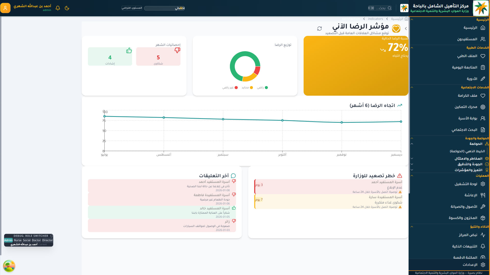

#### كَيف يُقاس

- **استبيان شهري** للأسرة عبر بَوابة الأسرة.
- **تَقييم نَوعي ربع سنوي**: حوار مباشر مع الأسرة، يُسَجَّل نَصيَّاً، ويُحلَّل دلالياً.
- **صوت المستفيد المباشر** (لمن يَستطيع التَعبير): تَسجيل صوتي / نَصي / رَمزي شَهري.

> **التزام جوهري:** صوت المستفيد لا يُعاقَب عليه أحد. هو مَدخَل تَحسين، لا أداة عقاب.

### ٨-٤ المكتبة الرقمية

شاشة المرجعيَّات والمعارف.

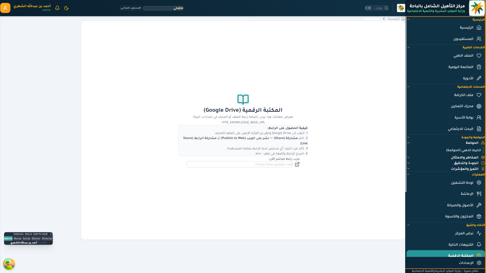

#### المحتوى

- السياسات والإجراءات الرسمية.
- الأدلة التشغيلية لكل تَخصُّص.
- مَوارد التَدريب الذاتي.
- مَراجع علمية وتَأهيلية.
- البحوث الداخلية.

> **للقارئ من القيادات:** ما يُولِّده النظام من مؤشِّرات يُغني عن طلب التقارير المتفرِّقة. صورة المركز في لوحة واحدة، تَفاصيلها قابلة للاستكشاف.

> **للقارئ من رؤساء الأقسام:** الإنذار المبكِّر يُتيح لك التَدخُّل وَقت يَصنع فرقاً، لا بعد فَوات الأوان.

> **للقارئ من إدارة الإشراف الاجتماعي:** المؤشِّرات الذكية تَنقل التَدقيق من الزيارات السنوية إلى المراقبة الذكية المستمرَّة، مع الزيارات للحالات التي تَستحقّ.

---

      

<h1 style="color: #F7941D; font-size: 88px; font-weight: 800; margin: 0; text-align: right;">٠٩</h1>
<h2 style="color: #0F3144; font-size: 36px; font-weight: 700; margin-top: 8px; text-align: right;">التقارير والمؤشرات الاستراتيجية</h2>

---

## ٠٩ — التقارير والمؤشرات الاستراتيجية

البَيانات لا تَكتسب قيمتها إلا حين تُتَرجَم إلى تَقارير قابلة للقراءة، تُعِين القيادة على القرار. وحدة التقارير هي ذلك الجسر.

### ٩-١ التقرير التنفيذي

شاشة موَحَّدة لتَوليد التقارير التَنفيذية.

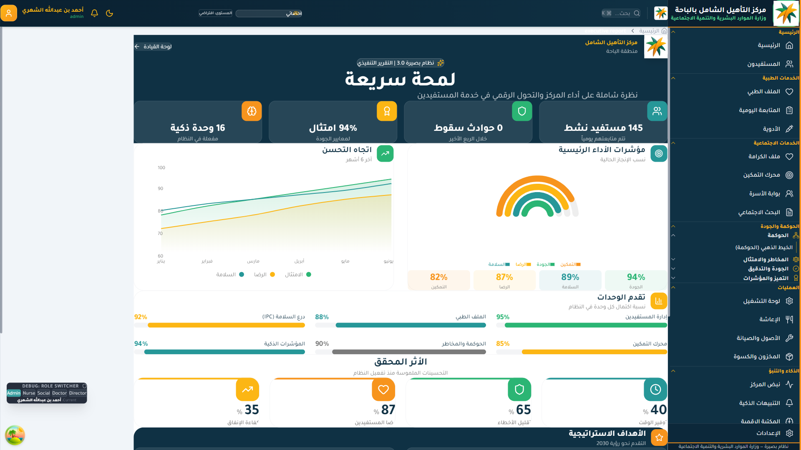

#### أنواع التقارير

- **تَقرير المركز الشهري**: نَظَرة عامة على الأداء، المؤشِّرات، الأحداث، الإنجازات.
- **تَقرير تَحليلي**: تَفصيل أكثر عمقاً، مَع مقارنات زمنية.
- **تَقرير مُخصَّص**: ينشئ المستخدم التَقرير بحَسب احتياجه.
- **تَقرير العائد الاجتماعي للاستثمار (SROI)**: حساب القيمة الاجتماعية المُولَّدة لكل ريال مَصروف.
- **تقارير تَستوفي متطلبات حقيبة مؤشِّرات الأداء الوزارية**.

### ٩-٢ المؤشِّرات الاستراتيجية

شاشة مَوصولة برؤية الوزارة الاستراتيجية ورؤية ٢٠٣٠.

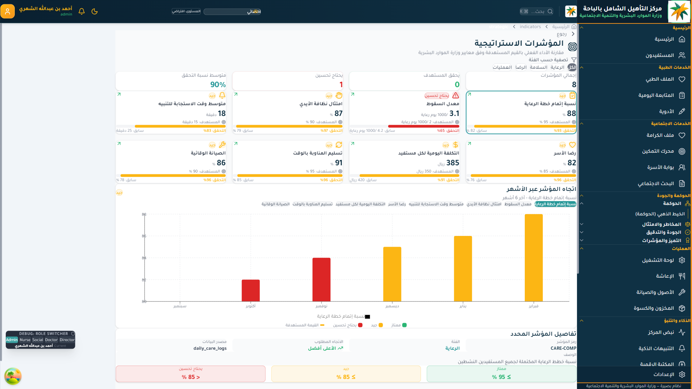

#### مَا تَعرضه

- **المُسْتهدَفات الاستراتيجية للمركز** ومستوى تَحقيقها.
- **المُسْتهدَفات على مستوى المنطقة**.
- **المُسْتهدَفات الوزارية** المرتبطة بالمركز (نسب التَأهيل، الكفاءة الإنفاقية، رضا المستفيدين).
- **محاور رؤية ٢٠٣٠** (جودة الحياة، تَنمية القدرات البشرية).
- **اتفاقية CRPD** ومُؤَشِّرات الالتزام بمَوادها.

### ٩-٣ تَقرير العائد الاجتماعي SROI

من أبرز مَيزات بصيرة الاستراتيجية. لكل ريال مَصروف على المركز، ما هو مَقدار القيمة الاجتماعية المُولَّدَة؟

#### كيف يُحَسب

- **التَكاليف المباشرة**: إيواء، رواتب، أدوية، إعاشة، أنشطة.
- **القيمة المُولَّدة**: تَخفيض احتياج الأسرة لرعاية مدفوعة، فرص العمل المُستحصَلَة، تَحسُّن الاستقلالية.
- **القيمة النَوعية**: الكرامة، حقّ المشاركة، أَثَر الأسرة (تُذكَر نصيَّاً لا رقمياً).

> **للقارئ من القيادات العليا والإدارة العامة:** التَقرير التَنفيذي يُجَهِّز لك الإجابة على سؤال "ما الذي تُحدِثه ميزانية مَراكز التأهيل؟"، بأرقام موثَّقَة، لا انطباعات.

> **للقارئ من المدير العام بفرع الوزارة:** المؤشِّرات الاستراتيجية تُتيح لك مقارنة المراكز ضمن فرعك، لا للمحاسبة العقابية، بل لتَوجيه الدَّعم لمَن يَحتاجه.

> **للقارئ من إدارة الإشراف الاجتماعي:** التَقرير المؤسسي يُغني عن جَولات التَفتيش المتكرِّرة لجَمع نَفس البيانات. التَفتيش يَتركَّز على ما لا تَكشفه البيانات.

---

      

<h1 style="color: #F7941D; font-size: 88px; font-weight: 800; margin: 0; text-align: right;">١٠</h1>
<h2 style="color: #0F3144; font-size: 36px; font-weight: 700; margin-top: 8px; text-align: right;">بُوصلة القيادة الاستراتيجية</h2>

---

## ١٠ — بُوصلة القيادة الاستراتيجية

من أكثر مَيزات بصيرة ابتكاراً. القرارات الاستراتيجية في المؤسسات الكبرى تُعاني من ثلاثة أمراض: تُتَّخذ بدون توثيق سياقها، تُنسى بمرور الزمن، ولا تُربَط بأثرها. بُوصلة القيادة تُعالج الأمراض الثلاثة.

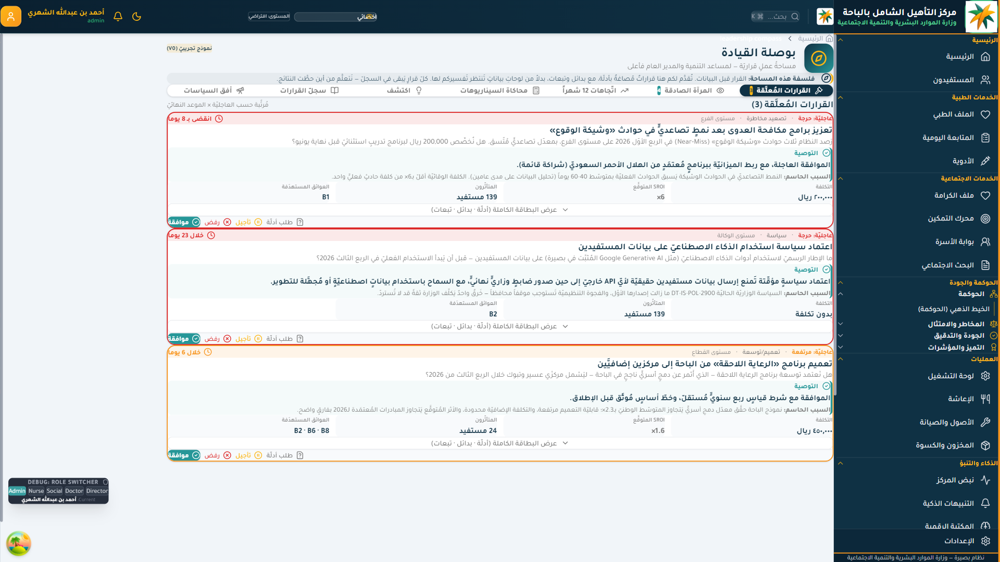

### ١٠-١ مكوِّنات البُوصلة

#### بطاقات القرار (Decision Cards)

لكل قَرار استراتيجي يُتَّخَذ، تُسجَّل بطاقة مُوَحَّدة:

- **السياق**: ما الذي اقتَضى القرار؟
- **البدائل المطروحَة**: مَا الخَيارات التي وُضعَت على الطاولة؟
- **البديل المختار**: ما الذي اخترناه؟ ولماذا؟
- **البدائل المرفوضَة**: لماذا رُفِضَت كل واحدة منها بشكل محدَّد؟
- **أصحاب المصلحة**: مَن يَتأَثَّر؟
- **الجدول الزمني للمراجعة**: متى نَعود لهذا القرار؟

#### النَتائج المرآة (Mirror Findings)

ملاحظات داخلية تَكشفها البيانات (لا التَفتيش):

> *"العنبر `أ` تَكَرَّر فيه استخدام الكرسي المتحرِّك ٣٠٪ أقلّ من العنبر `ب` رغم تَشابه ملفَّات المستفيدين — لماذا؟"*

> *"نسبة المستفيدين الذين تَحقَّقوا أهدافهم في الربع الأخير ارتَفَعَت ١٥٪ — أي تَدخُّل تَسبَّب في ذلك؟"*

هذه مرايا تُذكِّر القيادة بما تَنساه.

#### المسارات (Trajectories)

تَتبُّع زمني لمؤشِّر مُعَيَّن:

- هل يَتحسَّن أم يَتراجع؟
- ما العوامل المرتبطة بالتغيُّر؟
- لا يُتَّخَذ قَرار جديد إلا بعد مراجعة المسار.

#### أُفُق السياسة (Policy Horizon)

السياسات الوزارية القادمة المتوقَّعَة، وأَثَرها المُحتَمَل على المركز، حتى يَستعدَّ القائد لها قَبل أن تَفاجِئَه.

### ١٠-٢ القيمة المؤسسية

بدلاً من أن تُسلَّم القيادة الجديدة "ملف قرارات سابقة" مكتوبة في إيميلات وملاحظات متفرِّقة، تُسلَّم بُوصلة قيادة تَنبض حياً.

- يَستلم المدير الجديد بُوصلة جاهزة فيها كل قرار سابق بسياقه.
- يَستطيع تَتبُّع لماذا اتُّخذ كل قرار.
- يَرى أثره الفعلي.
- يَقرِّر إن كان يَستحقّ المراجعة.

### ١٠-٣ الذاكرة المؤسسية الحيَّة

بُوصلة القيادة هي الإجابة على سؤال:

> *"لماذا وافق المدير السابق على هذا القرار قبل ثلاث سنوات؟"*

في الأنظمة التَقليدية، الإجابة "لا أحد يَعرف". في بصيرة، الإجابة "افتح بَطاقة القَرار، اقرأ السياق والبدائل والمسوِّغ".

> **للقارئ من المدير العام بفرع الوزارة:** بُوصلة القيادة تَجمع لك قرارات كل المراكز في منطقتك، فترى الأنماط، تَكتشف الإخفاقات المتكرِّرة، وتُوَزِّع الدَّعم وفقها.

> **للقارئ من القيادات العليا:** بُوصلة على مستوى الوكالة تَنشأ من تَجميع بُوصلات المراكز. تَرى نمط القرار في القطاع كله، ومَن يَتَّخذ قرارات جيِّدة.

> **للقارئ من مدير المركز:** كل قرار تُسَجِّله يُحفَظ بسياقه. لا يُتَّهم لاحقاً أحد بقرار اتُّخذَ في وقت ضيِّق بدون فهم ظَرفه.

---

      

<h1 style="color: #F7941D; font-size: 88px; font-weight: 800; margin: 0; text-align: right;">١١</h1>
<h2 style="color: #0F3144; font-size: 36px; font-weight: 700; margin-top: 8px; text-align: right;">الإدارة والصلاحيات وسجلات التدقيق</h2>

---

## ١١ — الإدارة والصلاحيات وسجلات التدقيق

ركن النظام الإداري والتقني. هنا تُعَالَج الكوادر، الصلاحيات، والسجلات الكاملة لأنشطة المستخدمين.

### ١١-١ سجل التَدقيق

أكثر شَاشة احترافية في النظام، يَخضع لها كل تَفاعُل.

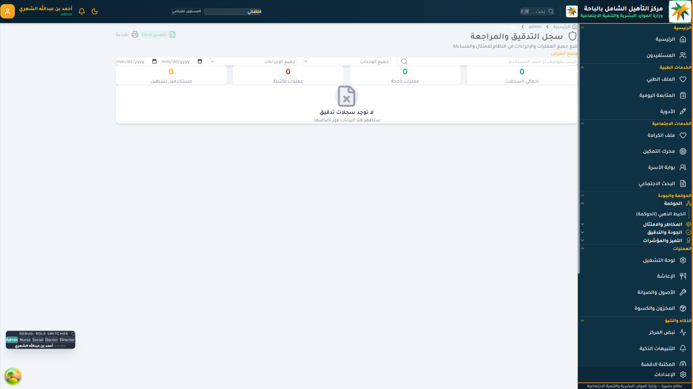

#### ما يُسَجَّل

كل عمل في النظام مَوثَّق بـ:

- **مُعرِّف المستخدم**: مَن قام بالعمل.
- **العمل**: ما الذي حَدَث (قراءة، كتابة، تَعديل، حذف).
- **الكائن**: على ماذا (مَلَفّ مستفيد، تَنبيه، تَقييم، تَقرير).
- **الطابع الزمني**: متى بِدِقَّة الميلي ثانية.
- **عنوان IP**: من أيِّ جهاز.
- **الجلسة**: تَتبُّع كامل للجلسة.

#### السجلات غير قابلة للتَعديل

- لا يَستطيع أي مستخدم — حتى المدير — تَعديل أو حذف سَجِلّ مَوجود.
- السجلات Append-Only.
- الاحتفاظ لِمدَّة ٧ سنوات.
- صَالحَة كمرجع قانوني عند الحاجة.

### ١١-٢ تَطبيق التزامات الأمن السيبراني

السجلات تَخدم:

- **سياسة `DT-IS-POL-1300 V7`** (إدارة سجلَّات الأحداث والمراقبة).
- **نظام حماية البيانات الشخصية (PDPL)** (الإخطار بالخرق، حقوق صاحب البيانات).
- **الضوابط الأساسية للأمن السيبراني NCA ECC-2:2024**.

### ١١-٣ الهيكل التَنظيمي والصَلاحيات

شاشة مرافِقَة لإدارة الكوادر:

- **هيكل المركز**: المدير، رؤساء الأقسام، الكوادر، تَوزيع العنابر.
- **بَطاقات الكوادر**: مع التَخصُّصات والشَهادات.
- **تَخصيص الصَلاحيات**: لكل دور صَلاحياته المحدَّدَة.
- **التَدريب والتَطوير**: تَتبُّع الدورات والشَهادات لكل موظف.
- **تَقييم الأداء**: نَموذج تَقييم سَنَوي مَوصول بمؤشِّرات الأداء الفعلية.

> **للقارئ من إدارة الموارد البشرية في المركز:** كل موظف لديه ملفّ كامل، يَتطوَّر معه. لا يَفقد إنجازَه إذا انتقل بين الأقسام.

> **للقارئ من إدارة الإشراف الاجتماعي:** التَدقيق يَستطيع كَشف أنماط مهمَّة (مثلاً: مَن يَدخل النظام في أوقات غير اعتيادية؟ مَن يُجري عمليَّات بكثافة على ملف معيَّن؟). أداة استكشافية، لا فقط أرشيفية.

> **للقارئ من القيادات في الوكالات المركزية:** التَدقيق على مستوى الوزارة يَستحقّ لجنة دَورية لمراجعته (يُنفَّذ في مَركز عمليَّات الأمن SOC). أنماط غير اعتيادية تَكشف ما تَفوته الزيارات الميدانية.

---

      

<h1 style="color: #F7941D; font-size: 88px; font-weight: 800; margin: 0; text-align: right;">١٢</h1>
<h2 style="color: #0F3144; font-size: 36px; font-weight: 700; margin-top: 8px; text-align: right;">لوحة القيادة الإشرافية الإقليمية</h2>

---

## ١٢ — لوحة القيادة الإشرافية الإقليمية

عند التَعميم على مَراكز متعدِّدة، يَنتقل النظام إلى مستوى تَجميعي يَخدم القيادات فوق المركز.

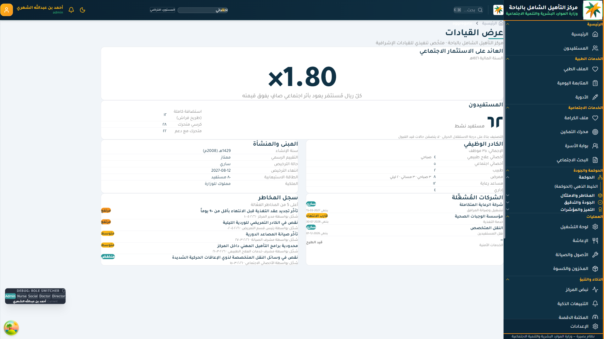

### ١٢-١ ما تَعرضه اللوحة

- **رؤية موحَّدة** لكل المراكز ضمن الفرع/المنطقة/الوكالة.
- **مقارنة شفّافة** بين المراكز (لا للمحاسبة العقابية، بل لتَوزيع الدَّعم وَتبادُل أفضل الممارسات).
- **رصد المخاطر مركزياً**: مَركز تَتراكم فيه إشارات احتراق وظيفي / تَدنِّي رضا / تَأخُّر في تَحديث الملفات.
- **المؤشِّرات المُقارَنَة**: نسبة تَفعيل بَوابة الأسرة، تَحديث ملف الكرامة، الحوادث، تَحقيق الأهداف.
- **التَنبيهات الإشرافية**: حالات تَستحقّ زيارة ميدانية.

### ١٢-٢ مَن يَستفيد من اللوحة

#### المدير العام بفرع الوزارة (أو الإدارة العامة في الفرع)

- لوحة على مستوى الفرع كاملاً.
- مَركز واحد على الفرع متراجع → دَعم استثنائي بدلاً من عقوبة.
- مَركز متفوِّق → دراسة تَجربته لنَقلها للآخرين.

#### إدارة الإشراف الاجتماعي بفرع الوزارة

- متابعة جودة الخدمات الاجتماعية في كل المراكز ضمن الفرع.
- التَأكُّد من تَطبيق سياسات الوزارة بشكل موَحَّد.
- تَدقيق مَلَفَّات الكرامة، تَحقيق الأهداف، رضا المستفيدين.
- تَوجيه الدَّعم الفنّي للمراكز التي تَحتاج دعماً.

#### الإدارة العامة لخدمات الفروع (في الوزارة)

- لوحة على مستوى المملكة كاملاً.
- مقارنة المناطق.
- تَوزيع الموارد على أساس الاحتياج المُقاس.
- تَقارير لمعالي الوزير ولمَجلس الشؤون الاقتصادية والتَنمية.

#### اللجنة العليا لبصيرة (مَجلس الإدارة)

- النَّظرة الاستراتيجية الشاملة.
- اعتماد التَطوير القادم.
- توجيه السياسات.

### ١٢-٣ المؤشِّرات الإشرافية الرئيسية

- نسبة تَفعيل بَوابة الأسرة في كل مَركز.
- نسبة تَحديث ملف الكرامة.
- متوسط الأهداف التَأهيلية المحَقَّقَة شهرياً لكل مستفيد.
- نسبة الموظفين تحت "خط الاحتراق" (محرك مروءة).
- نسبة الحوادث (مع تَنبيه إذا انخفَضَت بشكل غير طبيعي — قد يَدلُّ على إشكال في الإبلاغ، لا على تَحسُّن).
- مؤشِّر رضا المستفيد.
- نسبة الالتزام بـ PDPL.
- توفُّر النظام (Uptime).

> **للقارئ من المدير العام بفرع الوزارة:** لوحة الفَرع تُغني عن طلب تَقارير ربع سنوية متأخِّرة. الرؤية لحظية، الاستفسار العميق متاح بنقرة.

> **للقارئ من إدارة الإشراف الاجتماعي:** المؤشِّرات تُحدِّد لك أين تَزور، ولماذا، ومَع مَن تَتحدَّث. الزيارة الميدانية تَكتسب قيمة أعلى لأنها مَوجَّهة.

> **للقارئ من القيادات العليا في الوكالات المركزية:** على مستوى الوزارة، اللوحة تُجيب: هل تَتقدَّم المملكة في تَفكيك الحواجز الاجتماعية لذوي الإعاقة؟ — بإحصاءات قابلة للنَشر في تَقارير الرؤية وتَقارير CRPD الدورية.

---

# خَاتمة الدليل

نظام بصيرة ليس "نظام إدارة" بالمعنى التقليدي. هو **بنية تَفكير مؤسسي** لخدمة الأشخاص ذوي الإعاقة، مُعَبَّرٌ عنه في تَطبيق رقمي. هذا الدليل قَدَّم خَريطة الواجهات والوظائف، لكن القيمة الفعلية تَنشأ في الاستخدام اليومي:

- موظف يَفتح ملف الكرامة قَبل الملف الطبي.
- مدير يَستخدم بُوصلة القيادة قبل اجتماع.
- اختصاصي اجتماعي يَكتب هدفاً للمستفيد، لا للموظف.
- أسرة تَطمَئنُّ على وَلَدها عبر بَوابة موثوقة.
- قيادة عُليا تَملك بياناتها لا انطباعاتها.

كل واجهة في هذا الدليل أُعِدَّت لتَصبح **عادةً**. والعادة، حين تَتراكم في مؤسسة كاملة، تَصير **ثقافة**.

> *"البَصيرة ليست أن نَرى ما يَراه غيرنا، بل أن نُدرك ما خَفِيَ عنهم. ما يَخفى عن النظام التَقليدي هو الإنسان وراء الحالة. ما يَستحضره بصيرة هو ذلك الإنسان."*

---

# مَلاحق إضافية

تُكَمِّل هذا الدليل ملاحق متخصِّصة في مجلد `docs/guide/`:

- `guide-comprehensive-2026.md` — الدليل التَعريفي والتَشغيلي والتَنفيذي الشامل.
- `agency-rehabilitation.md` — مَوقع نظام بصيرة من الإطار التأهيلي للوزارة.
- `agency-beneficiary-experience.md` — تَكامُل النظام مع منظومة تَجربة المستفيد.
- `agency-digital-transformation.md` — التَفاصيل التَقنية للنظام.
- `agency-shared-services.md` — البُعد الإداري والمالي للنظام.
- `agency-strategy-vision.md` — مَوقع النظام من رؤية الوزارة الاستراتيجية ورؤية ٢٠٣٠.
- `cybersecurity-and-pdpl.md` — التَفاصيل الأمنية وحماية البيانات الشخصية.
- `INDEX.md` — فهرس الدليل الكامل.

---

www.hrsd.gov.sa

Classification: Strict مقيّد

